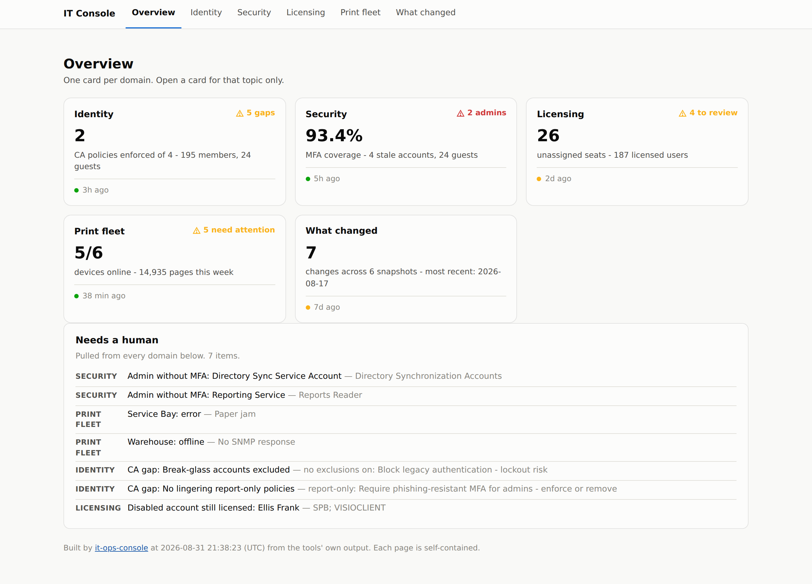
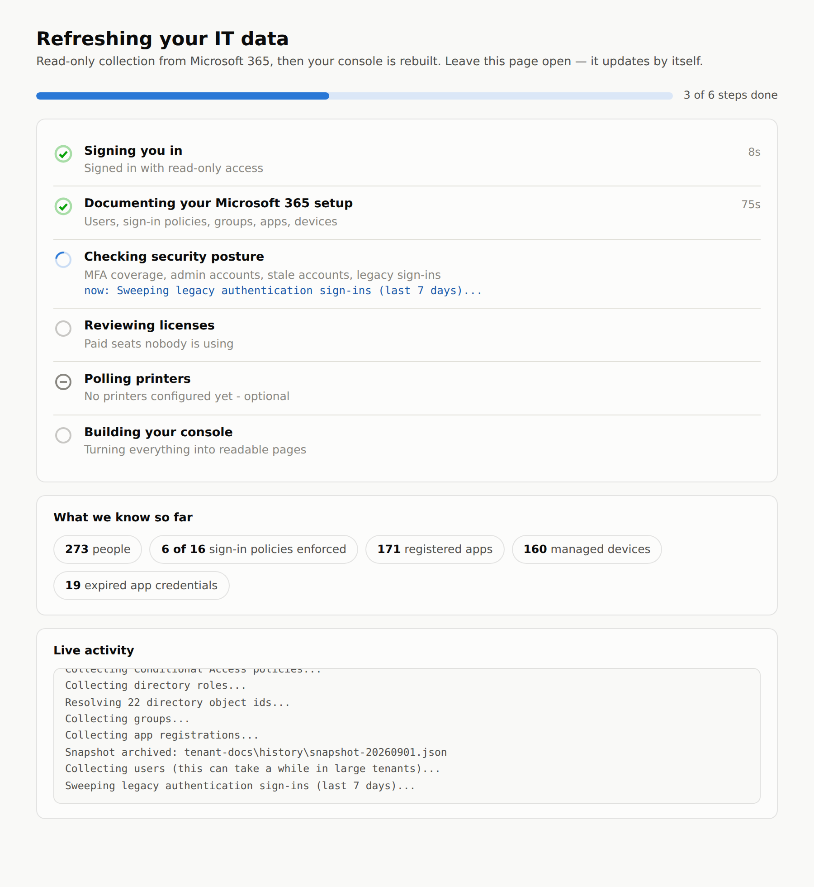

# it-ops-console

One page per topic, built from the output your other tools already produce.

Four separate tools means four separate outputs, and nobody opens four things.
This builds a small static site that puts them side by side: an overview with
the handful of numbers worth glancing at, then one page per domain that carries
the detail without burying it in the other three. It never collects anything
itself — it reads what the collectors wrote and renders it.

Everything it produces is plain HTML and CSS in a folder. No server, no
database, no JavaScript framework, no phoning home. Copy the folder to a file
share or point IIS at it and you have a console.



## What it reads

| Feed | Produced by | Feeds the page |
|---|---|---|
| `tenant.json` | [entra-tenant-docs](https://github.com/JonathanT10/entra-tenant-docs) `Export-EntraTenantDocs.ps1` | Identity |
| `run-summary.json` | same, same run | Identity (CA gap analysis) |
| `history/` | same, archived snapshots | What changed |
| `security-snapshot.json` | [entra-security-snapshot](https://github.com/JonathanT10/entra-security-snapshot) `-JsonPath` | Security |
| `licensing.json` | [m365-license-waste-report](https://github.com/JonathanT10/m365-license-waste-report) `-JsonPath` | Licensing |
| `fleet.db` | [print-fleet-dashboard](https://github.com/JonathanT10/print-fleet-dashboard) `collector.py` | Print fleet |

Every feed is optional. Configure two and you get two pages; the rest are
greyed out in the nav and labelled "not configured" rather than showing
zeroes that look like real numbers.

## The pages

**Overview** — one tile per domain with its headline number, a "needs a human"
panel, and a freshness dot per feed. That panel is not a second opinion: it is
**the alert rules** (see *Alerts* below), showing the critical and warning ones
that are firing right now, so the front page and the messages can never
disagree about what counts — and turning a rule off on the Alerts tab takes it
off here too. Every finding there — and wherever it reappears on its own page —
carries a one-line plain-English next step: not just *what's wrong* but *what
you do about it* ("exclude your break-glass accounts from every all-users MFA
policy", "have them register at aka.ms/mfasetup"), so a reader can act without
already knowing the answer. Informational findings (a toner at 15%) stay on
their own page, change events stay in the change log, and a refresh that went
wrong has its own banner rather than a line here.

**Identity** — tenant and user counts, Conditional Access policies by state, the
CA gap analysis, directory roles by membership size, groups, authentication
methods, app registrations, and Intune compliance and configuration when the
export included it.

**Security** — MFA coverage, admins without MFA, stale
member and guest accounts, legacy authentication sign-ins, and whatever the
snapshot flagged as needing attention.

**Licensing** — SKUs sorted by unassigned seats, reclaim candidates split into
disabled accounts (reclaim today) and stale accounts (ask first), and
self-service consumption SKUs kept separate so they stop inflating the waste
number. Add per-seat prices and it turns into dollars: unused-seat spend and
reclaimable-now spend, per month and per year, leading the page and the
overview tile. The first Refresh writes a `prices.ini` listing your own SKUs
into the license tool's folder — fill in the numbers and Refresh again.

**Print fleet** — devices sorted worst-first, toner levels as severity-coloured
meters, a page-volume sparkline per device, and anything that has not reported
in 48 hours marked offline regardless of what its last snapshot said. Plus
**Where we look**: name a subnet, a span or a single address and the next
refresh finds the printers on it for you — see *Finding printers* below.

**What changed** — the console recomputes the diff from the archived snapshots
rather than trusting a pre-baked list, so it stays correct even when the export
that wrote `run-summary.json` is older than the history folder. Conditional
Access, role assignments, licence purchases, app registrations, and Intune
policies.

**Alerts** — where alerts go (Teams, email, or nowhere yet), what is firing
right now with the same next-step line as the other pages, **every rule as a
control you can change**, how `alerts.ini` was read (a line it could not use is
listed, not silently ignored), and the last messages sent. See *Alerts* below.

## Finding printers, instead of typing them

Typing every printer's address gets old past a floor of them. On the **Print
fleet** tab, name a place to look instead — a subnet (`10.0.10.0/24`), a span
(`10.0.20.50-99`) or a single address — click **Save settings**, double-click
**Apply Settings**, and the next refresh looks there. Anything that answers as
a printer is added, named from its `sysName`, and polled from then on; a switch
or a server that merely speaks SNMP is passed over rather than recorded. The
tab then shows each place with how many addresses it covers, when it was last
looked at and how many printers came back.

The rows go into the printer collector's own `config.ini` under `[ranges]`, so
the tool still works on its own; the console is just a nicer way to fill it in.
Alongside them, **Look again every** (hours; 0 means only when you ask) and
**Leave alone** (addresses to skip even if a look finds them).

**It is a scan, and the page says so.** One SNMP request goes to every address
in every place you name — ordinary traffic on a network you run, but on some
networks it will show up in monitoring. Nothing is scanned until you name a
place. A place larger than 1024 addresses is **refused rather than attempted**,
and a place that cannot be read is reported by name on the tab and as an alert,
because a typo that quietly finds nothing looks exactly like a range with
nothing in it. Two alert rules come with it: *a new printer was found* (said
once, so you know it worked) and *a place to look could not be scanned*.

Polling now runs eight printers at a time, so a fleet that discovery grew does
not spend one device's timeout after another.

## Posture over time

A snapshot tells you where you are; a series tells you where you're heading.
`run-all.ps1` archives a timestamped copy of `security-snapshot.json` and
`licensing.json` after every successful run (into `output\history\security\`
and `output\history\licensing\`, mirroring what entra-tenant-docs already does
for itself), and the console turns those into small-multiple trend cards:

- **Security → Posture over time:** MFA coverage, admins without MFA, stale
  accounts, guests, legacy-auth sign-ins.
- **Licensing → Waste over time:** unused seats, reclaim candidates, licensed
  users — and, once your SKUs are priced, $/month unused and $/month
  reclaimable.
- **Overview tiles** (Security, Licensing) carry a sparkline and a
  "since last" delta so direction shows at a glance.

One point per calendar day (the latest run wins, so five refreshes in an
afternoon don't make a spiky chart), and every metric knows which way is
*good*: MFA coverage rising and waste falling read as improving (green, with a
check and the words); the wrong direction reads amber; flat and neutral
metrics stay muted. Never colour alone. With fewer than two days of data the
section simply says trends appear after the second refresh. Snapshots
accumulate (~150KB each) with no pruning yet — same as tenant-docs.

## Freshness is a first-class citizen

A console that quietly shows last month's numbers is worse than no console.
Every feed carries the timestamp its tool wrote, and every page says how old its
data is. Under 26 hours is fresh (a daily job that ran late still counts), up to
8 days is aging, beyond that is stale and says so loudly — on the overview, on
the page itself, and in the build output.

The builder also prints a feed table and a warning when anything has gone stale,
so a scheduled build tells you in its own log that a collector has stopped
running.

## The easy way — download one file, double-click it

Grab **`IT-Ops-Suite-v<version>.zip`** from the
[latest release](https://github.com/JonathanT10/it-ops-console/releases/latest),
extract it anywhere, and double-click `Setup-IT-Ops-Console.cmd`. That is the
whole instruction: the bundle carries all five tools, installs without
touching the internet, and stamps its version into the console's footer so
"which build are you on?" always has an answer. (Windows may show "Windows
protected your PC" for a downloaded file — click **More info → Run anyway**.)

**Updating is the same motion.** Download the newest release zip and run its
`Setup-IT-Ops-Console.cmd` over your existing install: every tool is refreshed
from the bundle and **your settings are kept** — `config.ini` (your printers),
`prices.ini` (your per-seat prices), and any database sitting in a tool folder
are set aside and put back, and setup tells you which ones it kept. Only the
`*.example.ini` templates ever come from the bundle.

No release handy? [`Setup-IT-Ops-Console.cmd`](Setup-IT-Ops-Console.cmd) alone
works too — it downloads what the bundle would have carried, though on an
existing install it refreshes only the console; use a release bundle to update
the other tools. Releases are assembled by [`make-release.ps1`](make-release.ps1)
from the repos' current main branches.

Prefer to see what you are running first? Download [`setup.ps1`](setup.ps1)
itself and right-click → **Run with PowerShell**. Same result. It creates
`C:\IT-Ops`, downloads all five tools, installs the Graph modules, checks for
Python and offers to install it, writes a `sources.ini` where everything
already points at everything else, and puts three shortcuts on your desktop:

- **Refresh IT Ops Data** — runs every collector (you sign in when asked),
  then rebuilds the console. Double-click it on whatever rhythm suits you.
  A live progress page opens in your browser while it works: each step with
  a spinner and plain-English label, the collector's own activity streaming
  underneath, and stat chips appearing as data lands — then a plain-English
  finish with one button to open the console. (`-NoStatusPage` for
  scheduled runs.)
- **IT Ops Console** — opens the result in your browser.
- **Apply Settings** — applies whatever you changed on the console's Alerts tab
  (see *Alerts*) or Print fleet tab (see *Finding printers*). Only needed when
  you change something there.



Nothing stores a password: collection is read-only and you sign in
interactively each refresh (or, if you choose it below, a certificate that
never leaves the computer does). Works in Windows PowerShell 5.1 — the one
"right-click → Run with PowerShell" actually launches — as well as
PowerShell 7. Printers are optional; add their IPs to
`tools\print-fleet-dashboard\config.ini` whenever you get to it.

### Keeping it fresh automatically

Setup's last question is how the console should stay up to date. Three
answers, and re-running setup lets you change your mind:

1. **I'll click "Refresh IT Ops Data" myself.** The default. Nothing is
   scheduled, and every refresh signs out of Microsoft 365 when it finishes.
2. **Refresh every day while I'm signed in.** A Task Scheduler job runs as
   you, only while you are logged on (if the computer was asleep at the set
   time it runs when it wakes). No password is stored. To avoid asking you to
   sign in every morning, **this computer stays signed in to Microsoft Graph
   (read-only) between refreshes.** That saved sign-in is encrypted to your
   Windows account by Windows itself, so other local users and a copied disk
   cannot read it; the footer of every console page and `check-setup.ps1` say
   in words that it is kept; and picking answer 1 later removes the schedule
   and signs out on the spot. It can still ask you to sign in again after a
   password change or a sign-in policy that requires it — and if nobody is
   there to finish that window within five minutes, the refresh carries on
   without Microsoft 365 data, keeps the previous numbers, and the console
   overview says so in one sentence.
3. **Refresh every day even when nobody is signed in.** For a shared PC or a
   server. Needs a **Global Administrator once**, about 15 minutes: setup
   makes a certificate whose private key stays in the computer's certificate
   store and cannot be exported, saves the public half to your desktop, and
   prints the exact clicks — register an app, add the same ten *read-only*
   permissions as application permissions, grant admin consent, upload the
   certificate, copy two IDs. Setup never creates the app itself; that one
   write to your tenant stays a human step, on purpose, because everything
   else here is read-only. It then **proves the sign-in works** (reads your
   organisation's name) before scheduling anything, and the job runs as
   SYSTEM, which the folder lock below already trusts. No password anywhere;
   the certificate lasts two years, and the console and `check-setup.ps1` warn
   you 30 days before it expires — re-run setup then and it makes a new one.

Whatever the answer, `run-all.ps1` tries the routes it has in order — the
registered app, then the saved sign-in, then a sign-in window with a time
limit — and **a route it had to pass over is reported, not hidden**: an
expired certificate shows on the overview even when the saved sign-in still
worked. Every refresh writes `output\refresh-status.json` (how it signed in,
what it passed over, certificate days left); the console reads it for the
footer note and the overview banner, and `check-setup.ps1` reads it along
with the Task Scheduler job's last result. The choice itself lives in
`tools\it-ops-console\automatic-refresh.ini` — schedule, two IDs, a
thumbprint; nothing secret — and survives updates like every other `.ini`.

### Alerts — Teams or email, only when something changes

Every refresh already works out what needs a human — and the rules that decide
that are the same ones that decide what is worth a message. One catalog, two
jobs: the critical and warning alerts that are firing are what the overview
lists under **Needs a human**, and alerts send them to a Teams channel and/or
an email address. Turning a rule off takes it off both (the domain page itself
still shows everything). They are built so nobody learns to ignore them: by
default a message goes out **only when an alert is new, has got worse, or has
cleared** since the last message, grouped by tab, each line carrying the same
plain-English next step the console shows. A weekly summary
(Mondays unless you change it) lists everything still open, or says "nothing
open" — a heartbeat that also proves the refresh is running.

**Turning it on.** Setup writes `tools\it-ops-console\alerts.ini` with every
rule at its default and no channel. Paste your channel's Workflows URL under
`[teams]` (in Teams: channel → ⋯ → Workflows → "Post to a channel when a
webhook request is received"), or fill in `[email]` with your internal relay,
then prove it from the console folder:

```
python notify.py --test
```

**What is watched** is one line per rule, one section per tab — a yes/no or a
number where 0 means off — and `notify = no` at the top of a section silences
that whole tab without touching its rules:

```ini
[security]
notify = yes
admin_without_mfa = yes        ; any admin with no MFA method registered
mfa_coverage_below = 90        ; percent
stale_accounts_above = 20
legacy_auth_signins = yes
```

The full list with a sentence on each rule is [`alerts.example.ini`](alerts.example.ini);
the console's **Alerts** page shows the same list as controls you can change, what
is firing, and any line it could not read. Identity: critical and warning CA
gaps, expired and expiring app credentials. Security: admins without MFA, MFA
coverage, stale accounts, legacy authentication. Licensing: disabled accounts
still licensed, unassigned seats, unused-seat cost. Print fleet: offline, error,
low supplies. What changed: Conditional Access, role grants, app registrations,
licence counts, Intune (each change reported once). Refresh: could not sign in,
a collector failed, certificate expiring, data older than N days.

**Changing the rules from the console.** The Alerts tab is the settings page:
tick, untick, or type a new number, and the box at the bottom shows the exact
settings your changes produce. **Save settings** copies that to the clipboard
and drops a copy in your Downloads folder; then double-click **Apply Settings**
on your desktop and it lands.

Two steps rather than one, and deliberately so. The console is a folder of
static HTML files — that is what lets you open it with no server running, and
copy `console-site` onto a share for other people to read — and a page opened
from a file cannot write into `C:\IT-Ops` by itself. The consequence worth
knowing: **the page never contains, and never changes, where your alerts go.**
The settings it produces cover the rules and the schedule only, so no Workflows
URL is ever baked into a page, put on your clipboard, or left in Downloads.
`[teams]` and `[email]` stay in `alerts.ini`, under the folder lock, edited by
hand the once.

`Apply Settings` **merges** rather than overwrites: your comments, your
channel settings, and any line a newer version of the console wrote are all left
alone, and only the settings you changed move. It keeps the previous file as
`alerts.ini.bak`, writes nothing at all if the result would not read back
cleanly, and says what changed in plain words — "MFA coverage falls below: 90%
to 95%. Print fleet: all alerts silenced." If your clipboard holds something
else by the time you get there, it falls back to the copy in Downloads; if that
is missing too, it tells you the four steps rather than failing. `python
apply-alerts.py --dry-run` shows what it would do without doing it.

**How it is built.** `console/alerts.py` is a catalog: one entry per rule (tab,
label, on/off or threshold, default, severity, evaluate) that yields alerts with
a stable key. `build.py` runs it on every build and writes `output\alerts.json`
— the renderer still sends nothing and holds no credentials. `notify.py` is the
one thing in this repository that talks to the network, and only to your webhook
and your relay: it compares `alerts.json` with `output\alerts-state.json` (what
people were already told), decides, sends, and records. `run-all.ps1` runs it as
its last step and skips it in words when no channel is configured. Adding a rule
is one catalog entry; `alerts.example.ini` is generated from the catalog and a
test fails if the two drift. Adding a channel is one function.

**Security.** The Workflows URL lets anyone holding it post into that channel,
so it lives in `alerts.ini` under the folder lock (you, Administrators, SYSTEM);
set `ITOPS_TEAMS_WEBHOOK` in the environment instead if you would rather keep it
out of a file. Email is relay-only by design — there are no username or password
fields anywhere here, so a relay that requires a login is out of scope. Alert text
carries admin names and UPNs, the same as the console; pick a channel whose
members should see that. Names are neutralised so a hostile display name cannot
become a link in a card.

Running entra-tenant-docs on its own? Its `Send-TenantDocsAlert.ps1` still works
as before; the suite's alerts cover the same ground and more.

**If something goes wrong:** run [`check-setup.ps1`](check-setup.ps1)
(right-click → Run with PowerShell). It is read-only, says in plain words what
is missing and what to do about each thing, and writes `check-setup.log` for
whoever is helping you. Setup keeps its own `setup.log` the same way, and a
failed refresh ends with an "In plain words" section that translates the error
into an action.

## Setup by hand

Python 3.8 or newer. No third-party packages — standard library only.

```
git clone <this repo>
cd it-ops-console
python build.py --sample --out console-site
```

That builds the whole site from the bundled demo data, no tenant and no
printers required. Open `console-site/index.html` to see what you would get.

For your own data, copy the config and edit the paths:

```
cp sources.example.ini sources.ini
python build.py --config sources.ini --out C:\it-ops\console-site
```

Relative paths in `sources.ini` resolve against the config file's own folder,
not the current directory, so a scheduled task that starts in
`C:\Windows\System32` builds exactly the same site you get by hand. Backslash
separators in a config are normalized on Linux and macOS, so a `sources.ini`
written on Windows still loads there.

## Running everything in one go

`run-all.ps1` is the other half: it runs the collectors, then builds the
console.

```powershell
.\run-all.ps1 -ToolRoot C:\it-ops\tools `
              -OutputRoot C:\it-ops\output `
              -SitePath C:\inetpub\wwwroot\console
```

It signs into Graph once with the union of the three Entra tools' read-only
scopes, and each script reuses that context instead of prompting again. A
collector that fails does not stop the run — the failure is recorded, the
remaining tools still run, and the console is still built with that feed showing
its real age. The exit code is non-zero if anything failed, so a scheduled task
shows red instead of succeeding quietly.

```
Step                       Status   Seconds  Detail
-------------------------- -------- -------  ------------------------
entra-tenant-docs          ok          74.2
entra-security-snapshot    FAILED       3.1  Insufficient privileges to complete the operation.
m365-license-waste-report  ok          41.9
print-fleet-collector      skipped        0  no -FleetConfig/-FleetDb given
console build              ok           0.4
```

The printer collector normally runs on its own short timer, so `run-all.ps1`
leaves it alone unless you pass `-FleetConfig` and `-FleetDb`. The fleet
database is opened read-only by the console, so it is safe to build while the
collector is writing to it.

Scheduling by hand (setup's last question does this for you — see *Keeping
it fresh automatically* above — but the raw form is):

```powershell
$action  = New-ScheduledTaskAction -Execute 'powershell.exe' `
    -Argument '-NoProfile -File C:\it-ops\tools\it-ops-console\run-all.ps1 -OutputRoot C:\it-ops\output -SitePath C:\inetpub\wwwroot\console -Scheduled -NoStatusPage'
$trigger = New-ScheduledTaskTrigger -Daily -At 4am
Register-ScheduledTask -TaskName 'IT ops console' -Action $action -Trigger $trigger
```

`-Scheduled` puts a time limit on the sign-in (default five minutes; see
`-SignInTimeoutSeconds`) so a window nobody is there to finish cannot hang the
run. Already connected app-only with your own certificate? `-NoConnect` uses
that session as-is.

## Permissions

Read-only, all of it. Nothing in this repo or in `run-all.ps1` writes to Entra,
Intune, or a printer. The scopes are whatever the underlying tools need:
`Directory.Read.All`, `Policy.Read.All`, `RoleManagement.Read.Directory`,
`Application.Read.All`, `Organization.Read.All`, `User.Read.All`,
`AuditLog.Read.All`, and the three `DeviceManagement*.Read.All` scopes for the
Intune sections. Skip a tool and you can skip its scopes.

## Who can read what it collects

The collected data — admin names, stale-account lists, the app inventory — lands
under the install folder (`C:\IT-Ops` by default). A folder under `C:\` is
readable by every local user out of the box, and that read access is the real
exposure, so **setup locks the install folder to the person who installed it,
`Administrators`, and `SYSTEM`; every other local user is shut out.** No secret
is stored either way — collection is read-only and reads credential *names* and
expiry dates, never a secret value — so this is about who can read findings, not
credential theft. `check-setup.ps1` flags it if that lock is ever missing.

Two things this ACL implies. Setup's unattended schedule runs as `SYSTEM`,
which is already in the lock; if you instead run a **scheduled refresh as some
other service account**, grant that account access to the folder (it inherits
nothing automatically). And if you deliberately **serve
`console-site` off this box** — a file share or a web root — you loosen the lock
on that subfolder yourself; the default assumes the console stays local.

## Design notes

**The console is a renderer, nothing more.** It has no credentials, no network
calls, and no scheduler (`notify.py`, the alert sender, is a separate program
run after the build, and is the only thing here that sends anything). That boundary is deliberate: collection is where the
permissions, the rate limits, and the failure modes live, and keeping it out of
the renderer means the console cannot be the reason a run failed. It also means
you can rebuild the site from yesterday's JSON to see exactly what it looked
like yesterday.

**A missing feed is a normal state, not an error.** No feed raises. A corrupt
JSON file, a deleted database, a tool nobody has run yet — each becomes a page
that says what is wrong and a nav entry that says "not configured". A console
that crashes because one of six inputs is bad is a console you stop trusting.

**Colour is never the only signal.** Status is an icon plus a label; the colour
reinforces it. Meters carry their number. The palette holds up in dark mode and
for colour-vision deficiency.

**Deterministic output.** Given the same feeds, the build produces the same HTML
apart from the generated-at footer and the relative ages ("3h ago"), which are
by definition read off the clock. Nothing else varies between runs, so diffing
last week's build against today's shows you real drift and not churn.

## Tests

```
python tests/test_console.py
python tests/test_notify.py
python tests/test_apply_alerts.py
pwsh tests/test_run_all_signin.ps1
pwsh tests/test_schedule_refresh.ps1
```

`test_console.py` (223 checks) covers freshness classification, timestamp
parsing, feed degradation (corrupt JSON, missing files, unconfigured sources),
every model, change detection, rendering with zero feeds configured, HTML
escaping of hostile input, the automatic-refresh footer note and banners, the
alert catalog (every rule fires and stays quiet on the right data, thresholds
and silenced tabs honoured, `alerts.example.ini` identical to what the catalog
renders, unusable lines reported), alert state (new / worse / cleared / told),
the Alerts page, the overview panel being the rules themselves (a rule turned
off or a threshold moved changes the front page; one noisy rule is capped at
five rows with a pointer to its page; change events and refresh troubles stay
out), and a full sample build. `test_notify.py` (34 checks) runs
`notify.py` against a local fake webhook and a local fake mail relay: first run
tells everything, a repeat stays quiet, new and worse speak, cleared is said
once, events are never "cleared", the weekly digest fires on its day, a failed
post leaves alerts untold so they are retried, `--test` and `--dry-run`.
`test_apply_alerts.py` (37 checks) covers editing from the console: the merge
keeps comments, the `[teams]` webhook and lines from newer versions, refuses a
file it cannot parse, and never writes on a bad paste — and then opens the real
page in a browser and applies what it produces, including the check that
matters most, that an **untouched** page round-trips to exactly the settings
already in force (which is what stops the page and the rules drifting apart).
That last part needs Playwright; without it those checks say so and skip. The two
PowerShell suites drive `run-all.ps1` and `schedule-refresh.ps1` against stub
collectors, a stub Graph module, and stub Task Scheduler and certificate
cmdlets: every rung of the sign-in ladder made to succeed, fail, or hang; the
sign-out rule; the alerts step skipped in words, sending to a local webhook,
and failing in plain words; what Task Scheduler is asked to register and as
whom; the proof-before-scheduling rule; and that the certificate a person
uploads is the one kept. Nothing in any of them touches Microsoft 365 or Windows.

## Licence

MIT.
